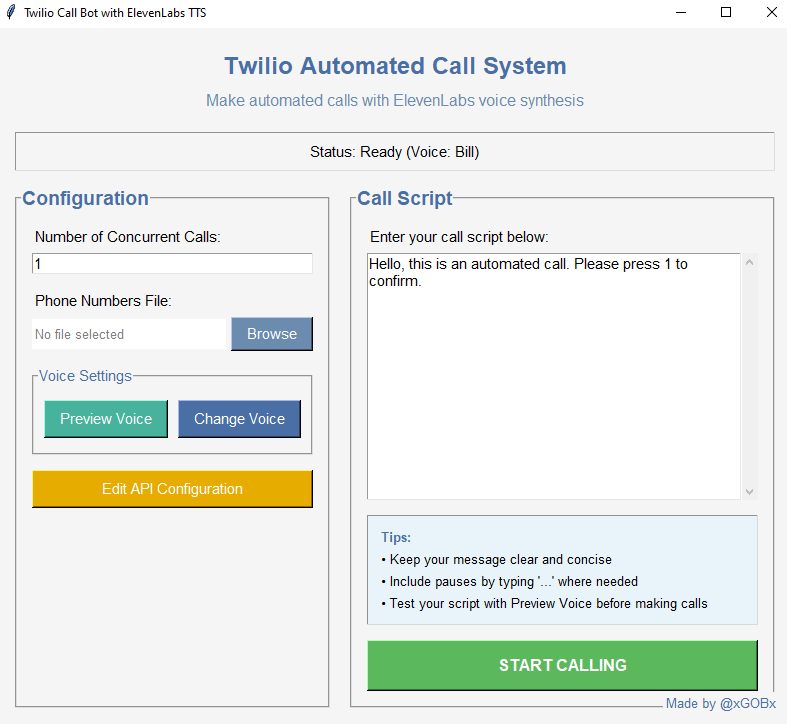
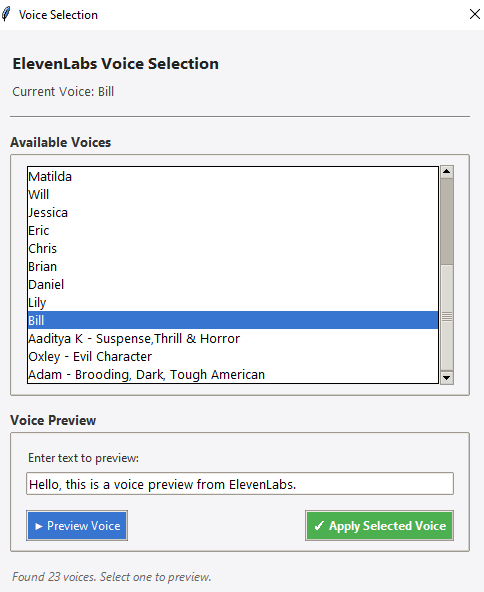

# TwilioCallBot README

## Overview
TwilioCallBot is a voice-driven automated calling system that utilizes Twilio for telephony services and ElevenLabs for text-to-speech capabilities. This application allows you to program and deploy automated voice calls with natural-sounding speech.

## Prerequisites

### Python Requirements
- Python 3.8+ (development was done using Python 3.8.3)
- All dependencies listed in `requirements.txt`

### External Services
1. **Twilio Account** - For making and receiving phone calls
2. **ElevenLabs Account** - For high-quality text-to-speech conversion
3. **ngrok** - For exposing your local server to the internet

## Installation Steps

### 1. Clone or Download the Repository
```
git clone <repository-url>
cd TwilioCallBot
```

### 2. Set Up Python Environment
```
python -m venv venv
source venv/bin/activate  # On Windows: venv\Scripts\activate
pip install -r requirements.txt
```

### 3. Install and Configure ngrok

ngrok is a tunneling service that makes your local server accessible to the internet, allowing Twilio to communicate with your application.

1. Download ngrok from [https://ngrok.com/](https://ngrok.com/)
2. Follow ngrok's installation instructions for your operating system
3. After installing, authenticate ngrok:
   ```
   ngrok authtoken <your-ngrok-auth-token>
   ```

### 4. Set Up Twilio Account

1. Sign up for a Twilio account at [https://www.twilio.com/](https://www.twilio.com/)
2. Once registered, navigate to your Dashboard to find your **Account SID** and **Auth Token**
3. Create a Twilio phone number(One free number with trail account) through the Twilio console

### 5. Set Up ElevenLabs Account

1. Create an account at [https://elevenlabs.io/](https://elevenlabs.io/)
2. Get your API key from [https://elevenlabs.io/app/settings/api-keys](https://elevenlabs.io/app/settings/api-keys)

### 6. Configure Your Application

1. Open the `config.json` file and update it with your credentials:
   ```json
   {
      "account_sid": "",
      "auth_token": "",
      "phone_number": "",
      "elevenlabs_api_key": "",
      "webhook_url": "",
      "voice_id": "",
      "voice_name": ""
   }
   ```
## Running the Application

1. Start your application:
The application automatically:
- Starts the Flask server
- Launches and manages ngrok
- Updates the config.json file witha the current ngrok URL
- Updates your Twilio webhook configuration

Your TwilioCallBot is now ready to receive and make calls!

## Important Notes

- Keep your API keys and tokens secure and never commit them to version control
- Your local server must be running for the CallBot to function

## Troubleshooting

- Check Twilio logs in the console if calls aren't connecting properly
- Verify your ElevenLabs API key has sufficient credits
- Ensure your `config.json` file has the correct credentials
- Check that your Flask app is running without errors



